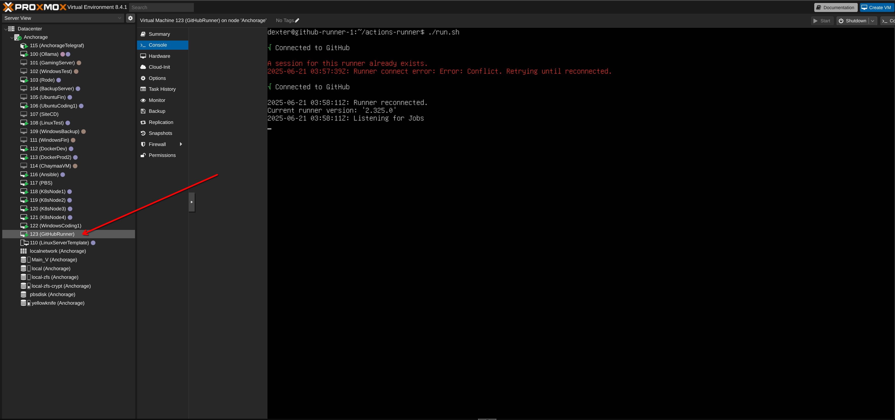
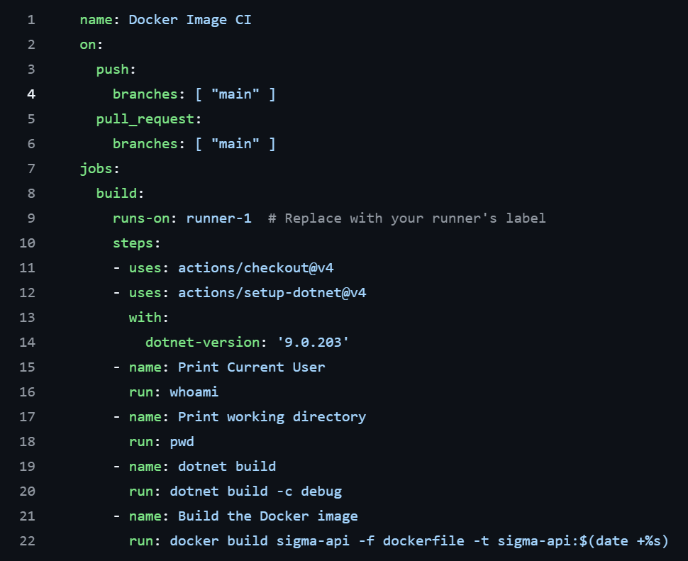
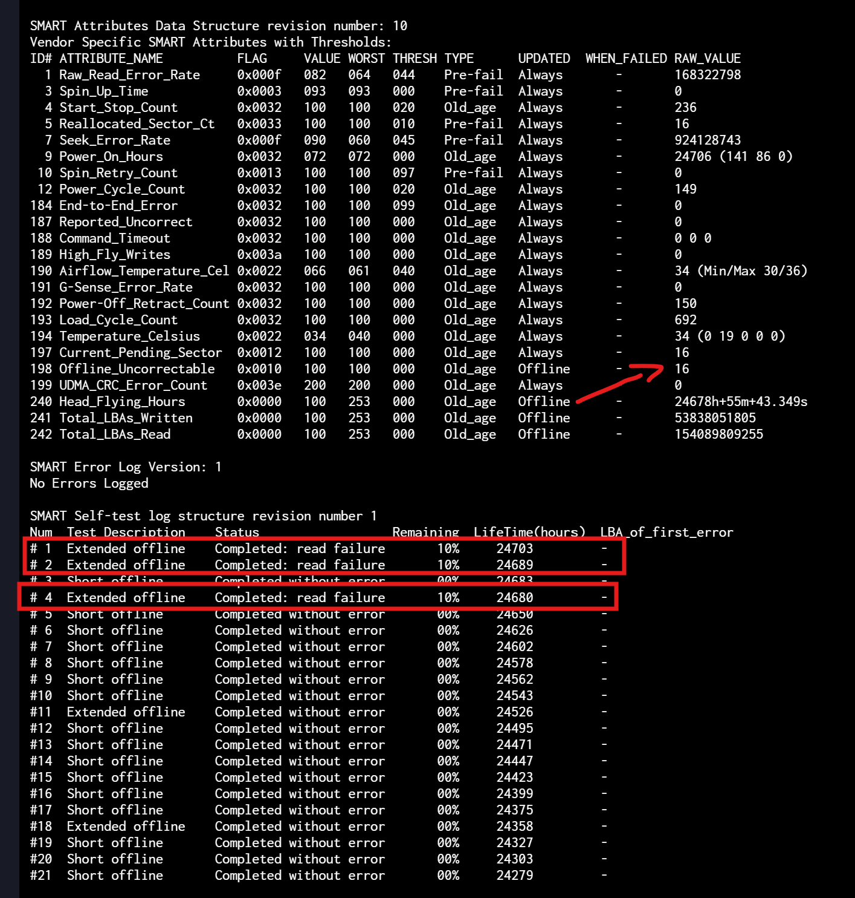

This is a blog repo to follow with my homelab and coding project

## 2025-06-18
Discovered nginx proxy manager. Ran it over in a docker container and was able to create a self signed certificate towards cloudglare.
The solution is incredible because I can finally remove the security warning from all my homelab services (been dreaming of this moment for the last 4 years). 
## 2025-06-20
### Nginx proxy manager
Currently adding all my services to pass through the proxy manager. Some services such as home automation are causing an http error.
Forums are saying that home assistant is not configured to run properly with a proxy out of the box. So I need to install a code editor in HA and add this to the configuration file:
```yaml
http:
    use_x_forwarded_for: true
    trusted_proxies:
    - x.x.x.x/24
```
Successfully added all the 30+ services and had an issue with the hp printer web services. The printer web portal seems to need a specific configuration to forward to a proxy. Will probably deal with it on a sunny day. I also learned that you can only reverse proxy and forward services with ports. Meaning that one cannot just forward a machine or vm ip address for RDP or ssh. For that I will probably need to use the already installed adguard home dns. It is a shame since I wanted to consolidate the subdomains assignments to one solution.

### Github agent
Added my first github runner today. I had the choice between having a runner controler that is deployed to a k8s cluster instead. I chose to start experimenting with a single agent for now and then upgrade if need be. The agent runs in a newly created VM inside proxmox. For now, I want to test out building docker images and pushing them to the self hosted docker container registry.



## 2025-06-21
### Github action
Troubleshooting build errors with a newly created github workflow. This is my first workflow and had some issues with adding permissions to the user being used by the runner. I had to give admin permission to the user to use docker without having to sudo. In addition, the docker build needs the project to have been already been built by dotnet. However, the runner does not have dotnet installed. So instead of installing it manually like I did with docker, github actions supports the using:dotnet inside a step. My current issue is that the using dotnet is also returning a permission error.



Reading about dotnet action issue seems to have been patched in 2022 https://github.com/actions/setup-dotnet. They introduced an env variable DOTNET_INSTALL_DIR: /home/[targetUser]/.dotnet to set if the action user does not have root permissions. This fixed my issue.

## 2025-06-21
### Dockerfile
Successfully built the first image using github actions and dockerfile. The docker file gave me many errors that had to be troubleshooted during many trial and errors. I had to maybe try 20 different commits for the first image to be created. My next step would be determine if building the project is better suited inside a dockerfile or a github action. Another next step would be to push the images to the docker local registry.

## 2025-06-23
### C#
Created two projects in a solution called sigma. The solution is mostly to help me practice creating C# projects from scratch instead of maintaining one already build and setup. The solution carries two projects for now, one called sigma-database, and one called sigma-api. The database one is a code first db that defines the db context. And the api one is where the REST controllers are located. I came across an issue with my VPN today while coding at a coffee shop. My sql server is hosted on my servers with a dns record dev.blue.paraluno.com and this record is used to define the projects connection strings. Meaning, that although my vpn is instructed to use my internal DNS, the DNS is not resolving. Will probably take the occasion to set up a new openvpn server since the one I have is depreciated.

## 2025-06-26
### Homepage dashboard
Updating most visited services to use the new xxxx.blue.paraluno.com address. Changes are only under the hood in order to no longer redirect to a hard coded ip address.


## 2025-06-29
### TrueNas NAS
The TrueNas server sent me a message in the morning saying there is a disk returning critical errors. After loging in to TrueNas dashboard, I see that the scheduled SMART test I set long time ago was failing for a particular disk. The UI however does not seem to give any more information about error details. So I had to run the `smartctl` command directly on the shell and checkout the SMART values. There seems to be a 16 unrecoverable sectors. Running a long self test again reveals the same thing. I take note of the disk SN and then swap its cable to troubleshoot. However, the disk continues to fail which is logical since the unrecoverable erros are mostly handeled by the drive controller and not affected by the cable. Unfortunetly, the drive is 3.5 years old and out of warranty. All of the current drives in the pools are Seagate and this is the second one failing since building the server. Thus, I am reflecting on the idea to replace the drive with Western Digital equivalence to probably offset of a design issue. I will propably plug the defective drive into a Windows VM and troubleshoot it further with the seagate software.


## 2025-07-07
### Linux SMB auto mount
Mounting SMB in linux is not as straight forward as it is in Windows. In Linux, mounting the drive from the file explorer will not expose the drive to the file selector from any browser for example. Therefore, the mount should be at a system level. This is done by adding an entry to fstab for each desired mount point. However, for some reason, the auto mount never worked on any linux for me. So I had to login to each linux server and then sudo mount -a every time. After some troubleshooting, I finally found that the service created for the auto mount was not enabled. Thus a simple systemctl status mnt-XXXXXX.automount fixed. 

## 2025-07-08
### TrueNas
The last few days have been very busy trying to recreate my storage solution. The storage server I built three years ago consisted of a pool of 4x 4tb Seagate Ironwolf drives in a RAIDZ2 layout. Meaning that two drives were striped while two were used for parity, thus gaving a 8TiB usuable storage after redendancy. A week ago, my second so far seagate ironwolf drive failed its smart test. The first one failed at year 1, and this one at year 3. So I did some research to see if I can replace the failing drive with an equivalent different brand model because I want to reduce the risk by variying the disk design. I settled on a WD red 4tb, which is supposed to be an equivalent but is 400rpm slower than the remaining ones. However, after replacing and resilvering the pool, I started flirting with the idea to add another 4tb disk and expand the pool size since my data has been growing a lot lately. However, the constraint with ZFS is that existing pools are not expandable once built. Meaning, that I had to destroy the pool to recreate a bigger one. And after some thoughts and deliberations, I took the decision to go through with it. I carefully carved up a step by step plan to properly make sure backups are up to date and some tests to make sure restore will be possible. Although I had three backups including an offsite one, deleting the pool and rebuilding was somehow stressful since I am responsible of the data of my partner. The whole procedure to reinstall the OS and reconfiguring + restoring the dataset was succesfull and less painful than what I thought it would be. Along the way, I had to rechallenge my knowledge about UNIX vs NSFv4 smb permissions and make sure not to lose access to data while recreating users since I had many users, for different services connecting the server for storage.

## 2025-07-20
### Proxmox gaming server
Troubleshooting why the gaming server streaming is stuttering. I have a gaming VM inside proxmox that has full access to an RTX3090. This VM has Windows as an OS and streams its video output through a service called sunshine https://app.lizardbyte.dev/Sunshine/. I connect to this gaming server using a client app called moonlight. I have been noticing recently that my connection client/server has been stuttering while streaming 4k games. I decided to connect my docking station to the switch over lan instead of using WIFI. This allowed my to set a QOS for both ports corresponding to proxmox and client. However, to my surprise the issue was not fixed. Troubleshooting deeper, I run a speed test inside the VM and discover that the download speeds are half of what they are supposed to be. Changing the network adapter setting from IntelE1000 to VirtIO increased the test speed from 500M/s to 1000M/s. An improvement can be made in the future by passing a network card directly to the VM and isolate it from the host port. 

## 2025-07-23
### Truenas ACL permissions
One of the things I miss the most about Synology NAS is how easy it was to setup advanced user permissions. It was very easy to give granular permissions to subfolders inside shares to different users without having access to the rest of the share. I had a scanner user (that creates new pdf for each scan) that had only access to a scanner folder inside the share folder of each person. That scanner user had only access to its folder and not the person other folder. It was meant to mitigate the danger of having the scanner being rogue and accessing all of the person data. Thus by having such granular permission one can mitigate the risk. So I kind of list this easy setup feature when migrating from Synology to TrueNas over the years. During the migration, I created a share called Scan that the scanner user had access to. However, each person scanned folder was not isolated. Meaning that person 1 and person 2 can see each others scanned files. Three years of that, and I finally found a solution by creating subdatasets in truenas. So TrueNas has the notion of datasets and not folder, meaning that we can create a dataset for each person but not the folders inside each dataset. The folders are created by the user once connected to the share with their client. However, I recently discovered the notion of creating subdatasets, which can present it self like folders inside the top dataset. And after some tests, I learned that the scanner user can be given only modify access to the subdataset as long as it had tranverse permissions on the above datasets. Did some tests earlier today and everything seems to be working. I of course had to modify the periodic snapshots including their replication to be recusive in order to include the subdatasets. But the latter seems to have worked on my initial tests and the subdataset was successfully replicated to the backup nas.

--Parent (Traverse permission)
    
    --Child (Modify permission)
